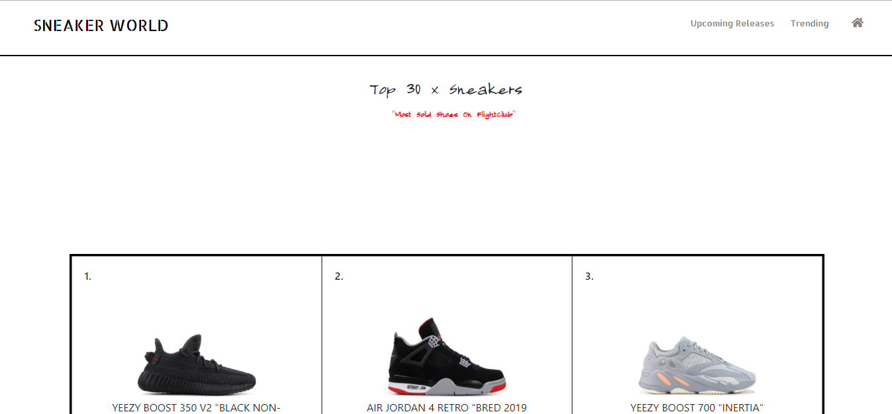

# shoejunkie
Sneaker Culture Web Application built with React Components. The application is designed to give sneaker enthusiast a information portable regarding 
upcoming sneaker releases as well as the top 30 trending shoes sold on flightclub.com . Look over it and give me feedback on improvements to the site or fork the website and add additional functionality.

<span>


</span>

<!-- {width=200px height=250px} -->

## Getting Started

To Get started do the NPM INSTALL command in the root directory once you have cloned the project to your local machine.
Then run an NPM START in the src directory to start the React App.

### Prerequisites

You need JavaScript Installed as well as NodeJS and MongoDB to run this application on your local machine.

### Installing

A step by step series of examples that tell you how to get a development env running

Clone The Repository to your machine in your command line

```
Git Clone <Github Url>
```

Install the dependencies from the root directory

```
npm i 

```
Start the react app from the src directory in the client folder
```
npm start

```

## Built With

* [React]- Used for building components and rendering elements
* [Express] - Framework used with NodeJS to build api's
* [Bootstrap] - StyleSheet Library
* [NodeJs] - Backend Enviroment
* [Cheerio] - Used to scrape web pages
* [Axios] - Used to make api calls


## Versioning

* Vol 1 

## Authors

* **Lazontez Gardner** - *Initial work* - [Lazontez](https://github.com/Lazontez)

See also the list of [contributors](https://github.com/Lazontez/Hermes/contributors) who participated in this project.

## License

This project is licensed under the MIT License - see the [LICENSE.md](LICENSE.md) file for details

